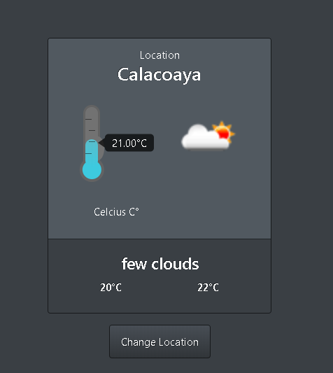

# HowsTheWeather, Project Web Weather App.

> HowsTheWeather Its a web app that allows a user to know the current temperature and other weather conditions in any given city in the world

## Built With

- HTML
- CSS
- Javascript
- OpenWeather API

## Live Demo

[HowsTheWeather](https://rawcdn.githack.com/carlosprietobarron/howstheweather/3eb290f2f3804a01a560040896a774b41795e8cd/index.html)

## How to install

First, please install node in your system [Node install instruction](https://nodejs.org/en/download/package-manager/)

Clone this repository, you can download it as a zip file if you prefer.

Run:  npm install on your terminal to install all the dependencies.

Open the index.html file

Enjoy!

## Authors

👤 Carlos Prieto Barron

- Github: [@carlosprietobarron](https://github.com/carlosprietobarron)

## 🤝 Contributing

Contributions, issues and feature requests are welcome!

Feel free to check the [issues page](issues/).

## Show your support

Give a ⭐️ if you like this project!

## Acknowledgments

- Hat tip to anyone whose code was used
- Inspiration
- etc

## 📝 License

This project is [MIT](lic.url) licensed.

